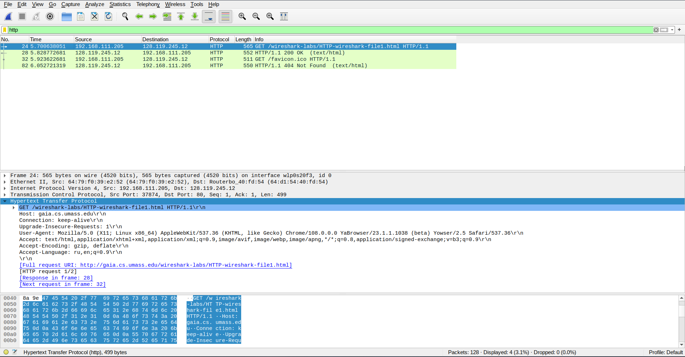
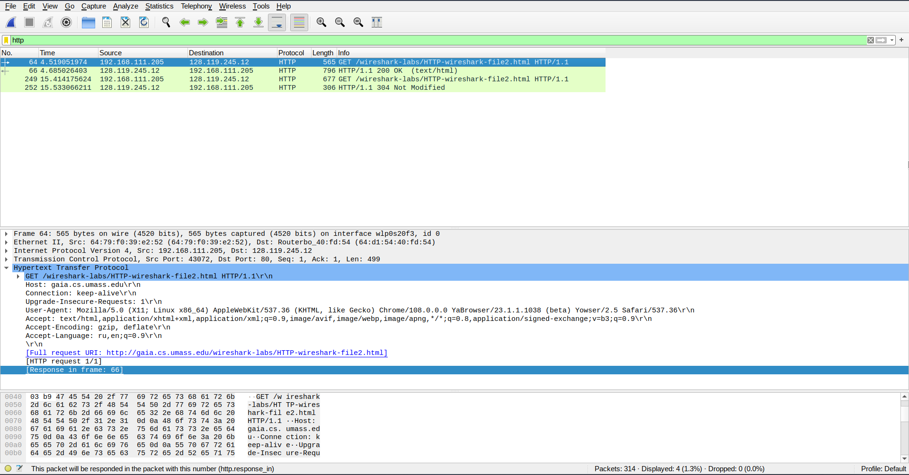
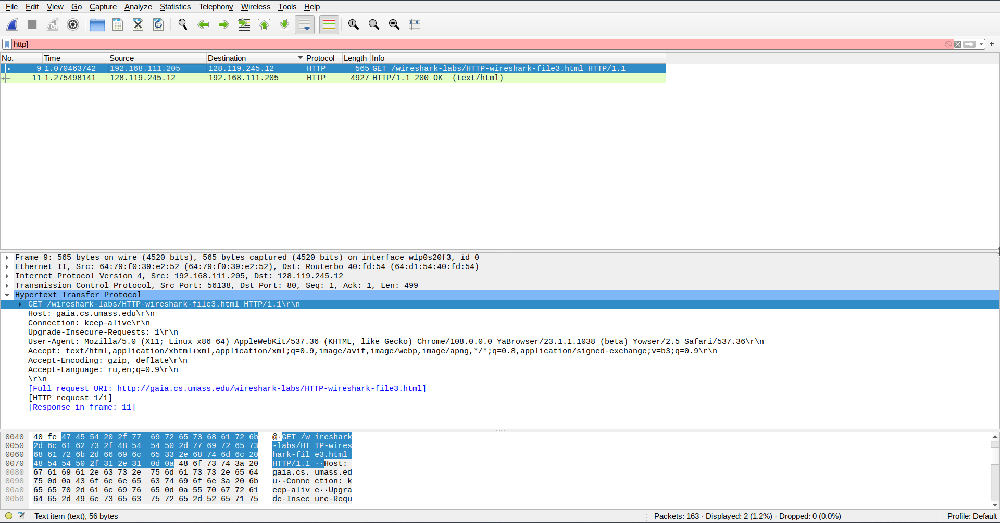
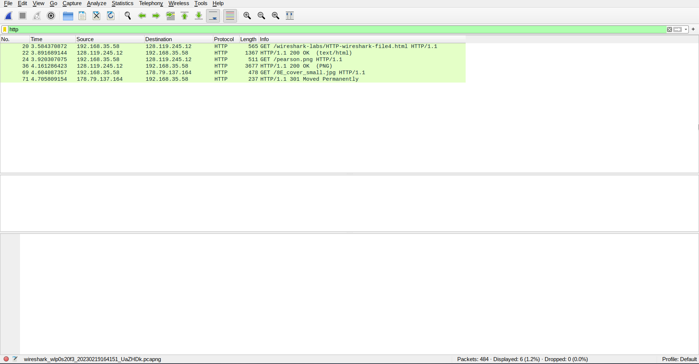
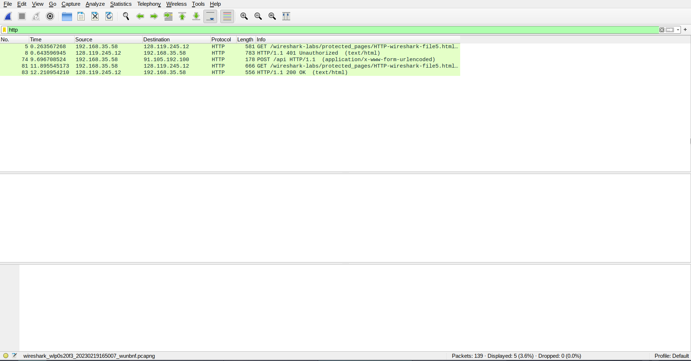

# TASK 1

1. Локально и на сервере HTTP 1.1
2. Браузер может принимать только русский и английский.
3. Мой ip-адрес -- 192.168.111.205	
   ip-адрес сервера -- 128.119.245.12
4. 200 OK
5. Last-Modified: Sun, 19 Feb 2023 06:59:01 GMT
6. Content-Length: 128

# TASK 2

1. Не вижу
2. Вернул содержимое явно, это можно увидеть во вкладке "Line-based text data"
3. If-Modified-Since: Sun, 19 Feb 2023 06:59:01 GMT
4. 304 Not Modified
   Явно содержимое не вернул

# TASK 3

1. Браузер отправил один запрос. 9
2. 11
3. Два
4. Нет

# TASK 4

1. Было отправлено три запроса. 128.119.245.12, 128.119.245.12, 178.79.137.164
1. Браузер загрузил изображения последовательно, т.к. GET запрос на второе изображение был послан только после ответа на первый.

# TASK 4

1. 401 Unauthorized
2. Появляется поле Authorization