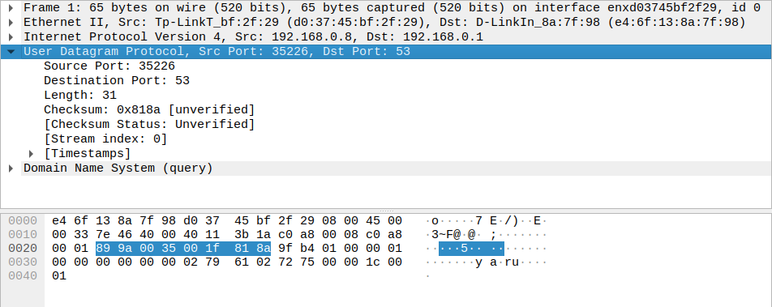
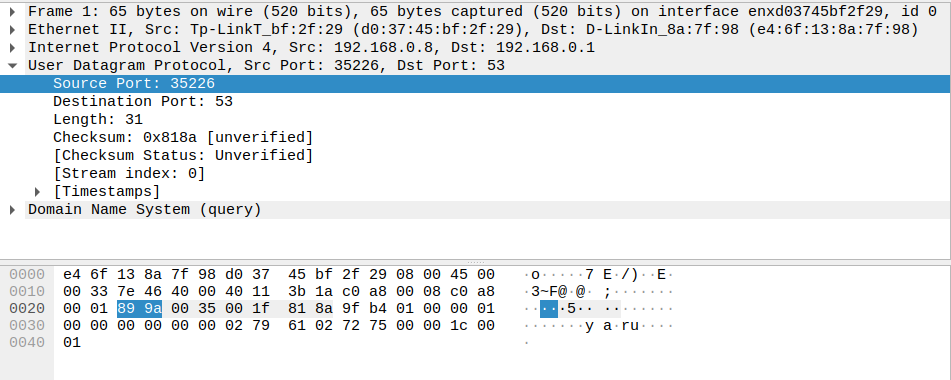
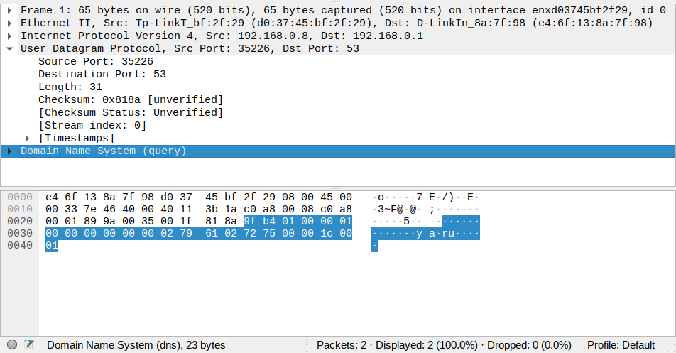
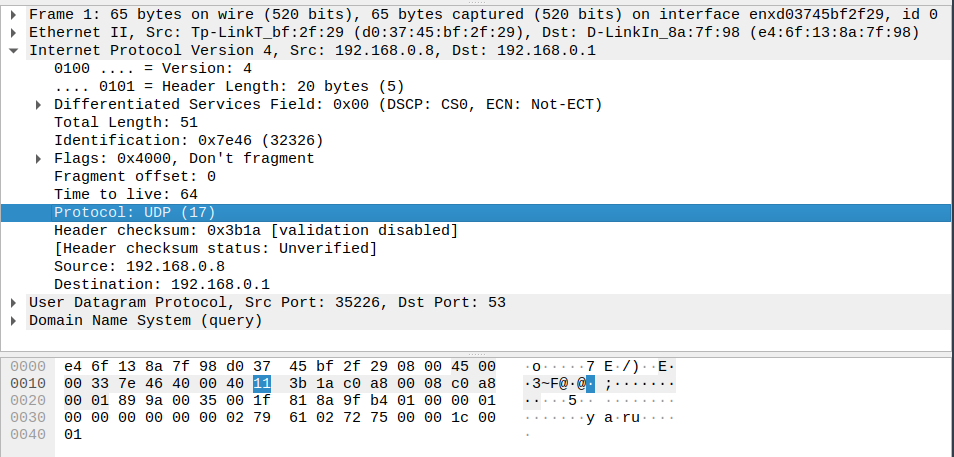
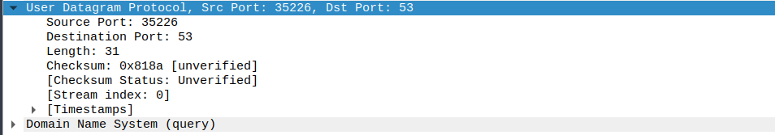
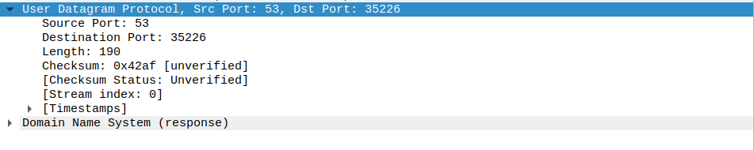

### 1

Заголовок содержит четыре поля

### 2

Каждое поле имеет размер два байта

### 3

Это длина заголовка и данных

### 4

Размер поля заголовка равен двум байтам, следовательно, length может принимать значения до 2^16 - 1 = 65535 включительно. При этом восемь байтов отводится на заголовок, следовательно, максимальный размер данных 65535 - 8 = 65527

### 5

Размер поля заголовка равен двум байтам, следовательно, максимальное значение порта отправителя - 65535. 

### 6

0x11, 17

### 7

Одинаковые порты, в ответе переставленные

Запрос

Ответ

