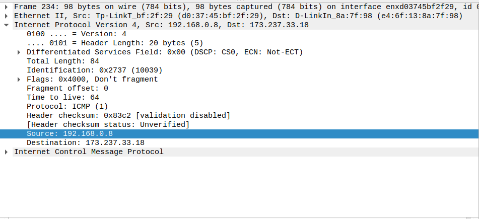
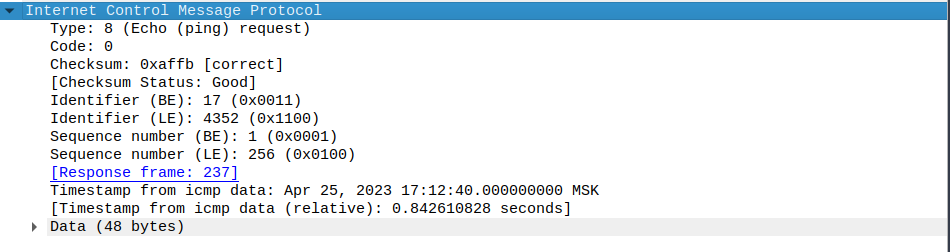
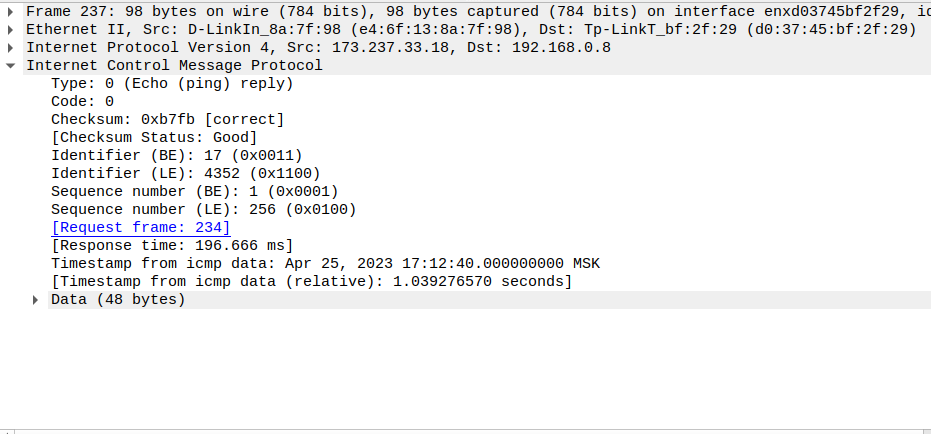

### 1

Адрес моего хоста - 192.168.0.8

Адрес хоста назначения - 173.237.33.18

### 2

Потому что это протокол сетевого уровня, задача которого коммуникация между хостами, а не приложениями.

### 3

Тип - 8, кодовый номер - 0

Еще есть следующие поля: контрольная сумма, идентификатор, порядковый номер, дата

Каждое поле по два байта, всего 6 байтов

### 4

Тип - 0, кодовый номер - 0

Еще есть следующие поля: контрольная сумма, идентификатор, порядковый номер, дата

Каждое поле по два байта, всего 6 байтов

