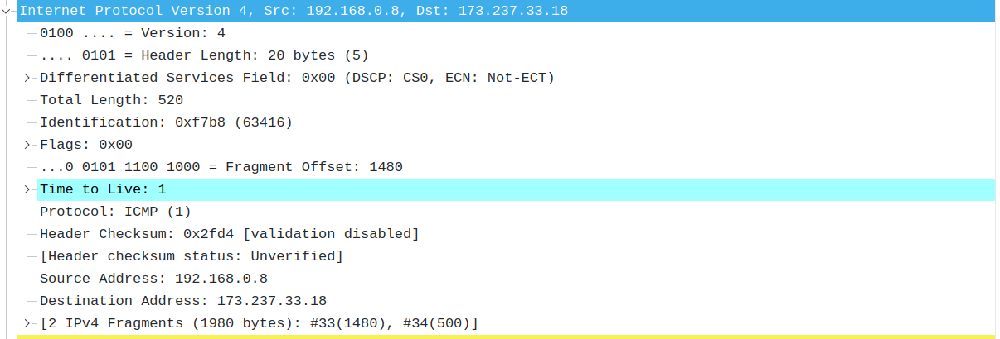

### 1

Source Address: 192.168.0.8

### 2

Ptorocol: ICMP (1)

### 3

Header Length: 20 байт

500 байт (Total Length: 520 - Header Length: 20)

### 4

a. Identification, Time to Live, Header Checksum

b. Version, Differentiated Services Field, Protocol, Source Address, Destination Address. Version, Differentiated Services Field, Protocol, Source Address, Destination Address. Identification, Time To Live, Header Checksum (но могут быть коллизии)

с. Увеличивается на один

### 5

63416, 1

### 6

Identification меняется

TTL одинаковый, это может быть связано с тем, что эти пакеты идут по одинаковому маршруту, следовательно, у всех пакотов TTL уменьшается на одинаковое число. Пакеты идут по одинаковому маршруту, т.к. они отправляются с ближайшего маршрутизатора.

### 7

43468, 64

### 8

Было создано три фрагмента

Total length, Checksum, Flags, Fragment Offset 

