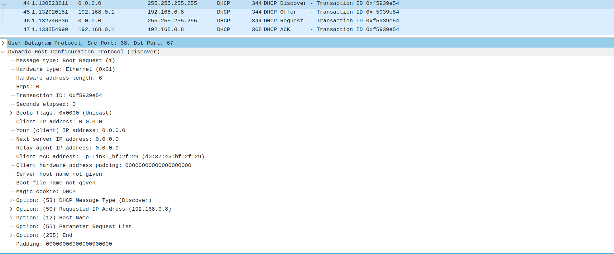
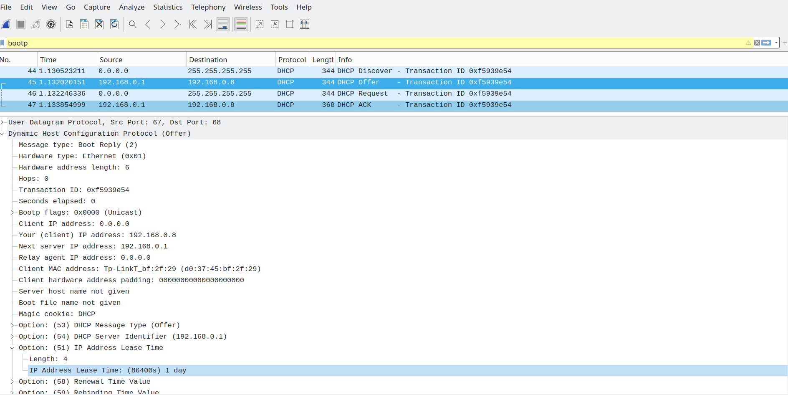

### 1

UDP

### 2

Tp-LinkT_bf:2f:29 (d0:37:45:bf:2f:29)

### 3

Transaction ID: 0xf5939e54

Это поле нужно для идентификации, на какой запрос пришел ответ от DHCP сервера

### 4

В моем случае клиент отправляет запросы широковещательно, а сервер отвечает на выдаваемый ip адрес (192.168.0.8)

### 5

192.168.0.1

### 6

IP Address Lease Time: (86400s) 1 day

Это нужно для освобождения ip адресов со временем, т.к. их конечное число

